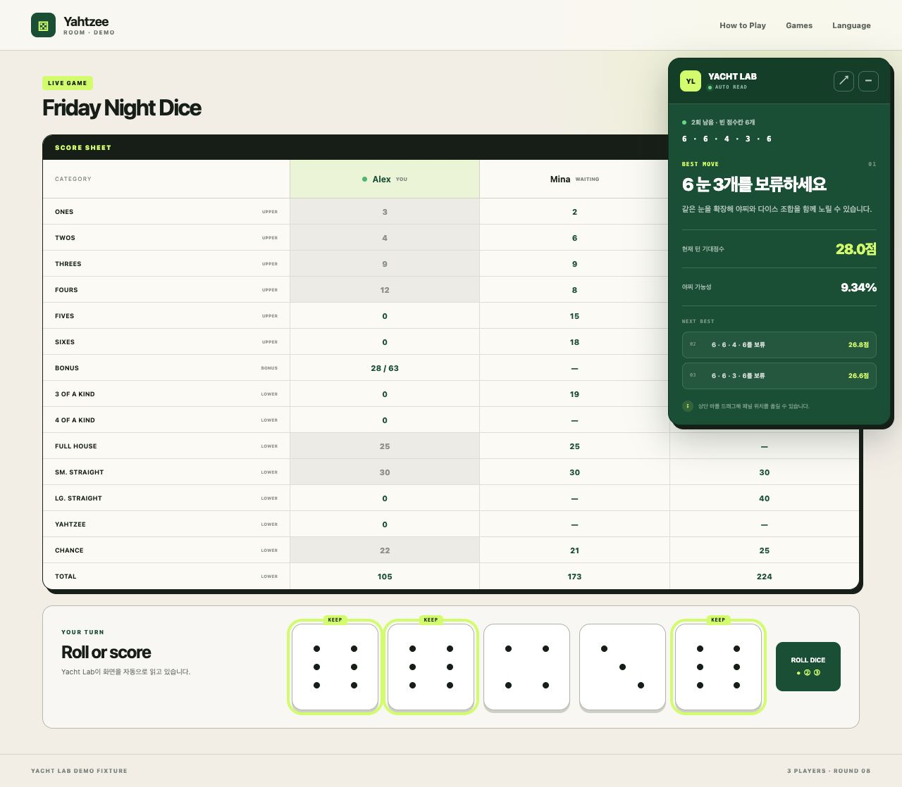
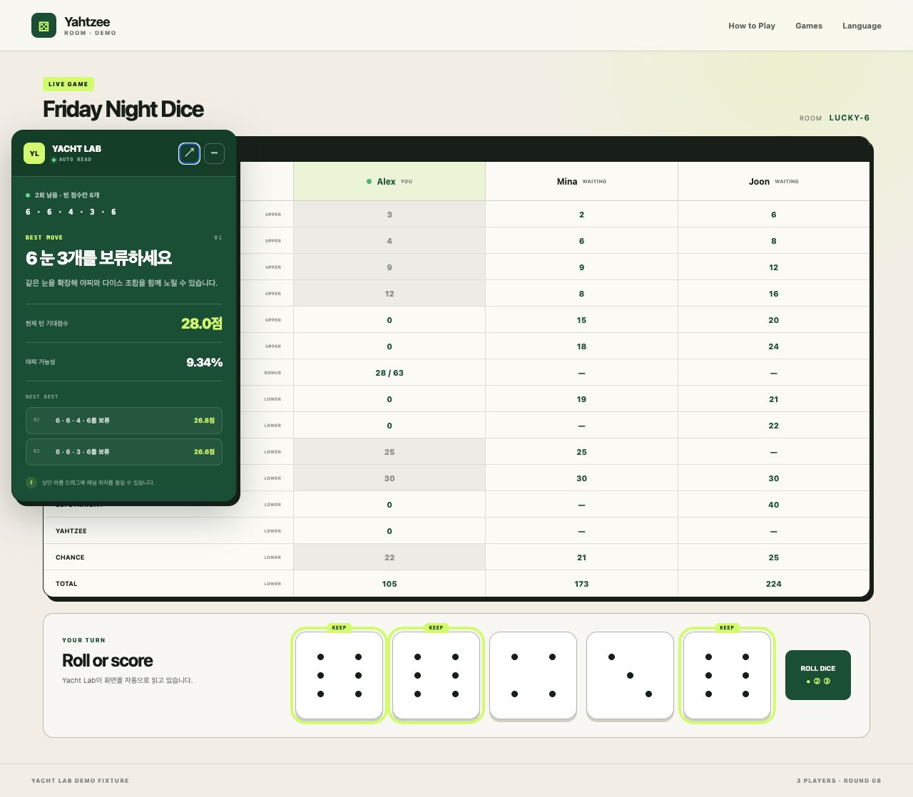

# Yacht Lab for BuddyBoardGames

BuddyBoardGames 야찌 화면을 자동으로 읽고, 현재 턴에서 기대점수가 가장 높은 선택을 알려주는 Chrome/Edge 확장 프로그램입니다.

주사위 숫자를 따로 입력할 필요가 없습니다. 내 차례가 되면 확장 프로그램이 주사위, 남은 굴림, 내 점수판을 읽고 보류할 주사위에 `KEEP` 표시를 붙입니다. 마지막 굴림 뒤에는 기록할 점수칸을 강조합니다.

> 이 프로젝트는 독립적으로 제작된 도구이며 BuddyBoardGames와 공식적으로 제휴하거나 보증받은 프로젝트가 아닙니다.

## 실행 화면





## 주요 기능

- BuddyBoardGames 화면의 주사위 값 자동 인식
- 현재 플레이어와 내 차례 자동 구분
- 이미 사용한 내 점수칸 자동 반영
- 남은 굴림 횟수 자동 추적
- 모든 보류 조합과 가능한 결과를 비교한 기대점수 계산
- 추천 주사위의 외곽선 및 `KEEP` 표시
- 마지막 굴림 후 추천 점수칸 강조
- 드래그 가능한 추천 패널과 네 모서리 빠른 이동
- 패널 위치 자동 저장
- 외부 서버 통신 없이 브라우저 안에서 계산

## 여러 명이 플레이할 때

확장 프로그램은 BuddyBoardGames의 내 플레이어 표시와 현재 차례 표시를 구분합니다.

- 상대 차례에는 분석을 멈추고 대기 상태를 표시합니다.
- 내 차례가 되면 내 점수판만 기준으로 전략을 계산합니다.
- 각 플레이어가 추천을 받으려면 자신의 브라우저에 각각 설치해야 합니다.
- 관전 화면에서는 내 플레이어가 없으므로 현재 차례 플레이어를 기준으로 분석합니다.

## 설치

### GitHub에서 설치

1. 이 저장소의 **Code → Download ZIP**을 선택합니다.
2. ZIP 파일의 압축을 풉니다.
3. Chrome에서 `chrome://extensions`를 엽니다. Edge는 `edge://extensions`를 엽니다.
4. 오른쪽 위의 **개발자 모드**를 켭니다.
5. **압축해제된 확장 프로그램을 로드합니다**를 선택합니다.
6. `manifest.json`이 들어 있는 저장소 폴더를 선택합니다.
7. [BuddyBoardGames Yahtzee](https://buddyboardgames.com/yahtzee)를 새로고침합니다.

업데이트한 뒤에는 확장 프로그램 관리 화면에서 새로고침 버튼을 누르고 게임 페이지도 다시 불러와 주세요.

## 사용법

1. 평소처럼 BuddyBoardGames에서 이름과 방을 입력해 게임을 시작합니다.
2. 내 차례에 주사위가 멈추면 오른쪽의 Yacht Lab 패널을 확인합니다.
3. 노란색 `KEEP` 표시가 붙은 주사위만 눌러 보류합니다.
4. 나머지 주사위를 굴리면 추천이 자동으로 다시 계산됩니다.
5. 마지막 굴림 뒤에는 노란색으로 강조된 점수칸을 확인합니다.

패널 상단을 드래그하면 원하는 위치로 옮길 수 있습니다. `↗` 버튼은 네 모서리를 차례로 이동하며, 상단 바를 더블클릭하면 오른쪽 위로 초기화됩니다.

## 계산 방식

Yacht Lab은 현재 주사위에서 가능한 보류 조합을 만든 뒤, 남은 굴림에서 발생할 수 있는 결과를 확률에 따라 전수 계산합니다. 이후 굴림에서도 최적 선택을 한다는 가정으로 남아 있는 점수칸의 기대점수를 비교합니다.

반영되는 항목:

- 상단 1~6 점수
- 트리플과 포카드
- 풀하우스
- 스몰/라지 스트레이트
- 야찌
- 찬스
- 상단 63점 도달 시 35점 보너스

현재 버전에서는 추가 야찌 보너스와 조커 규칙을 제외합니다.

## 패널 이동과 주사위 표시

추천 표시가 게임의 주사위 애니메이션을 방해하지 않도록 주사위 자체의 `transform`이나 `filter`를 변경하지 않습니다. 외곽선과 별도의 `KEEP` 라벨만 추가합니다.

패널 위치는 확장 프로그램 전용 저장소에 좌표만 저장됩니다. 브라우저 크기가 바뀌면 패널이 화면 밖으로 나가지 않도록 자동으로 조정됩니다.

## 권한과 개인정보

요청하는 권한은 다음 두 가지뿐입니다.

- `buddyboardgames.com/yahtzee` 페이지에서 콘텐츠 스크립트 실행
- 패널 위치 저장을 위한 `storage`

게임 정보, 플레이어 이름, 점수 또는 방문 기록을 외부 서버로 전송하지 않습니다. 주사위나 점수칸을 자동으로 클릭하지도 않습니다.

## 데모 실행

저장소 루트에서 간단한 정적 서버를 실행한 뒤 `demo/`를 열면 실제 게임 없이 확장 UI를 확인할 수 있습니다.

```bash
python3 -m http.server 4173
```

브라우저에서 `http://localhost:4173/demo/`를 엽니다.

## 파일 구성

```text
manifest.json       Chrome/Edge Manifest V3 설정
strategy.js         야찌 점수 및 기대값 계산 엔진
content.js          BuddyBoardGames 화면 인식과 UI 제어
overlay.css         패널, KEEP 표시, 점수칸 강조 스타일
demo/               문서와 스크린샷을 위한 재현 가능한 데모
docs/screenshots/   README 예시 화면
```

## 라이선스

[MIT License](LICENSE)
